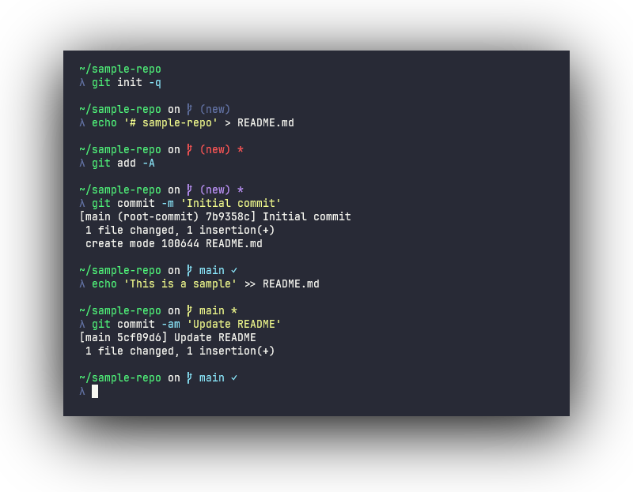

# zcmder-pwsh

A PowerShell port of my [zcmder](https://github.com/bwpge/zcmder) theme for `zsh`.

A lot of this module's implementation uses the great work done by the authors of [posh-git](https://github.com/dahlbyk/posh-git).

<p align="center"></p>

## Requirements

This module requires a minimum version of PowerShell 5.1 (a fresh install of Windows 10/11 should come with 5.1).

## Installation

Clone this repository and add the following to the top of your `$PROFILE` script:

```pwsh
Import-Module path\to\zcmder-pwsh\Zcmder
Set-ZcmderPrompt
```

### Symbolic Link

To avoid using the full path with `Import-Module`, you can create a symbolic link to this module in your PowerShell module directory (usually `$HOME\Documents\PowerShell\Modules`).

You can ensure this directory is created with (be sure to note the path):

```pwsh
New-Item ([System.IO.DirectoryInfo]$env:PSModulePath.Split(';')[0]) -Confirm -ItemType Directory -Force -EA 0
```

To create a symbolic link, you need to use an admin prompt and run:

```pwsh
New-Item -Confirm -ItemType SymbolicLink -Path your\modules\Zcmder -Target path\to\zcmder-pwsh\Zcmder
```

Then you can just use `Import-Module Zcmder` in your `$PROFILE` script.

## Configuration

This module uses a global variable `ZcmderOptions` to manage configuration. This object ([`ZCOptions`](https://github.com/bwpge/zcmder-pwsh/blob/main/Zcmder/ZcmderTypes.ps1)) has the following structure:

- [`ZCOptions.*`](#zcoptions)
- [`ZCOptions.Colors`](#zcoptionscolors)
- [`ZCOptions.Components`](#zcoptionscomponents)
- [`ZCOptions.Strings`](#zcoptionsstrings)
- [`ZCOptions.Styles`](#zcoptionsstyles)

When the module is imported by `Import-Module`, the variable is reset to ensure proper initialization. To customize settings, set your desired values *after* calling `Import-Module`.

Example `$PROFILE`:

```powershell
Import-Module Zcmder
Set-ZcmderPrompt

# zcmder options
$ZcmderOptions.Colors.GitBranchDefault = 'DarkMagenta'  # use magenta for default git branch color
$ZcmderOptions.Colors.GitNewRepo.Background = '#2277ff'  # use RGB value for new repo bg color
$ZcmderOptions.Components.PythonEnv = $false  # disable python env component
$ZcmderOptions.Strings.GitSeparator = ''  # don't print 'on ' before git prompt
$ZcmderOptions.Strings.GitPrefix = '■ '  # use different branch icon
$ZcmderOptions.Styles.Cwd.Underline = $true # use underline effect on cwd component
```

The following tables explains each option and usage.

### `ZCOptions.*`

Controls general behavior of the prompt.

| Key | Type | Usage |
| --- | ---- | ----- |
| `GitShowRemote` | bool | Show the remote with git status (e.g., `main:origin/main`) |
| `NewlineBeforePrompt` | bool | Print an empty line before the next prompt (excluding the first prompt) |
| `UnixPathStyle` | bool | Does some naive string manipulation on the current working directory component to print Unix-style paths. This is purely aesthetic and does not affect anything in the shell. |

### `ZCOptions.Colors`

Controls colors of the various items in the prompt.

Colors (`ZCColor`) are essentially a pair of color values, `Foreground` and `Background`. A color can be directly assigned to, implying a foreground color (e.g., `$ZcmderOptions.Colors.Cwd = 'DarkRed'`), or you can assign to the `Foreground` and `Background` properties directly (e.g., `$ZcmderOptions.Colors.Cwd.Background = '#FFFFFF'`).

Valid colors have the following form:

- [`ConsoleColor`](https://learn.microsoft.com/en-us/dotnet/api/system.consolecolor) enum name (e.g., `'DarkRed'` or `'White'`)
    - `ConsoleColor` names can be confusing: `Dark<color>` values are the "standard" colors, while `<color>` is the "bright" or "intense" variation
    - These values are converted to 256-color values (0-7 for standard, 8-15 for bright or intense)
- 256-color integer value (e.g., `8` for "bright black" or `142` for `Gold3`, see [this reference](https://ss64.com/bash/syntax-colors.html))
- Hex RGB string `'#RRGGBB'`
- `$null` for no color

Git status colors have the following priority:

- `GitStaged`
- `GitUnmerged`
- `GitUntracked`
- `GitModified`
- `GitNewRepo`
- `GitBranchDefault`

| Key | Type | Usage |
| --- | ---- | ----- |
| `Caret` | `ZCColor` | Default caret color |
| `CaretError` | `ZCColor` | Caret color when the last exit code was non-zero |
| `Cwd` | `ZCColor` | Color of the current working directory |
| `CwdReadOnly` | `ZCColor` | Color when the current working directory is read-only |
| `GitBranchDefault` | `ZCColor` | Default git status color |
| `GitModified` | `ZCColor` | Git status color when only tracked files are modified |
| `GitNewRepo` | `ZCColor` | Git status color when in a new repository |
| `GitStaged` | `ZCColor` | Git status color when all local changes are staged |
| `GitUnmerged` | `ZCColor` | Git status when there are unmerged changes |
| `GitUntracked` | `ZCColor` | Git status when untracked (dirty) files are present |
| `PythonEnv` | `ZCColor` | The color for current python environment name |
| `UserAndHost` | `ZCColor` | Color for both username and hostname components |

### `ZCOptions.Components`

Controls which components or segments of the prompt are printed.

| Key | Type | Usage |
| --- | ---- | ----- |
| `Cwd` | bool | Print the current working directory in the prompt |
| `GitStatus` | bool | Print a git status (if in a git repo) in the prompt |
| `Hostname` | bool | Print the hostname in the prompt |
| `PythonEnv` | bool | Print the current python environment (`conda`or `venv`) in the prompt |
| `Username` | bool | Print the username in the prompt |

### `ZCOptions.Strings`

Controls values or tokens in each component that are printed.

| Key | Type | Usage |
| --- | ---- | ----- |
|`Caret`| string | Prompt string (the value printed directly before user input area) |
|`CaretAdmin`| string | Prompt string when running with elevated permissions |
|`GitAheadPostfix`| string | Printed when repo is ahead of upstream |
|`GitBehindPostfix`| string | Printed when repo is behind upstream |
|`GitCleanPostfix`| string | Printed when repo has no local changes |
|`GitDirtyPostfix`| string | Printed when repo contains unstaged changes |
|`GitDivergedPostfix`| string | Printed when repo is both ahead and behind (diverged from) upstream |
|`GitLabelNew`| string | Label to use for a new repository |
|`GitPrefix`| string | Prefix always printed for git status e.g., a branch icon or `git(` |
|`GitSeparator`| string | A separator or preamble before the git status is printed e.g., `' on '` |
|`GitStashedModifier`| string | Printed when repo contains stashes |
|`GitSuffix`| string | Suffix always printed for git status e.g., `)` |
|`ReadOnlyPrefix`| string | Printed before current working directory when read-only |

### `ZCOptions.Styles`

Controls effects (bold, italic, inverted, etc.) of the various items in the prompt.

A style (`ZCStyle`) contains boolean properties for each supported effect:

- `Bold`: render bold or "intense" text (some terminals render this with "bright" colors and no font weight)
- `Dim`: render faint text (some terminals treat this as bold)
- `Italic`: render italicized text (some terminals treat this as inverse or blink effect)
- `Underline`: render underlined text
- `Invert`: swap background and foreground colors (this effect may not be supported by all terminals)

Example:

```powershell
# enable all effects for cwd component
$ZcmderOptions.Styles.Cwd.Bold = $true
$ZcmderOptions.Styles.Cwd.Dim = $true
$ZcmderOptions.Styles.Cwd.Italic = $true
$ZcmderOptions.Styles.Cwd.Underline = $true
$ZcmderOptions.Styles.Cwd.Invert = $true
```

A helper function `New-ZCStyle` is provided to create a style with switches for each effect:

```powershell
# use underline on caret
$ZCmderOptions.Styles.Caret = New-ZCStyle -Underline
# use all effects for cwd component
$ZcmderOptions.Styles.Cwd = New-ZCStyle -Bold -Dim -Italic -Underline -Invert
```

| Key | Type | Usage |
| --- | ---- | ----- |
| `Caret` | `ZCStyle` | Controls effects for the `Caret` component |
| `Cwd` | `ZCStyle` | Controls effects for the `Cwd` component |
| `GitStatus` | `ZCStyle` | Controls effects for the `GitStatus` component |
| `PythonEnv` | `ZCStyle` | Controls effects for the `PythonEnv` component |
| `UserAndHost` | `ZCStyle` | Controls effects for both `Username` and `Hostname` components |

Note that not all terminal emulators support every effect listed. Some terminals (e.g., Windows Terminal) require [explicitly adjusting settings](https://learn.microsoft.com/en-us/windows/terminal/customize-settings/profile-appearance#intense-text-formatting) to render certain effects.

## Debugging

You can display debug information with the `Write-ZcmderDebugInfo` cmdlet. This is useful if you get a `PS>` prompt (which indicates the `prompt` function had error output). The cmdlet will attempt to write the prompt and display error information.

The output of `Write-ZcmderDebugInfo` is particularly helpful to attach in issues:

```
MODULE INFO
-----------

Guid       2f55cab3-5190-4291-839a-4f45b5ae19b2
ModuleBase C:\Users\user\Documents\PowerShell\Modules\Zcmder
Name       Zcmder
Path       C:\Users\user\Documents\PowerShell\Modules\Zcmder\Zcmder.psm1
Version    0.2.3


PROMPT OUTPUT
-------------

>>>>>>>>>>

\x1b[38;5;2m~/sample-repo\x1b[0m on \x1b[38;5;8m (new)\x1b[0m
\x1b[38;5;8mλ\x1b[0m
<<<<<<<<<<

GIT STATUS
----------

Ahead     0
Behind    0
Changes   0
Dir       C:\Users\user\sample-repo\.git
Diverged  0
IsNew     True
IsRepo    True
Label     "(new)"
Modified  0
Remote    ""
Staged    0
Stashed   0
Unmerged  0
Untracked 0

OPTIONS
-------

Colors.Caret               {fg=Integer(8), bg=None}
...
UnixPathStyle              True

STATS
-----

Parse git status                103.7931 ms
Render component: caret         0.9889 ms
Render component: cwd           29.7986 ms
Render component: git status    19.8342 ms
Render component: python env    0.6766 ms
Render component: user and host 2.4411 ms
Render full prompt              136.6042 ms
```

You may want to sanitize your username if it is captured in the output.
